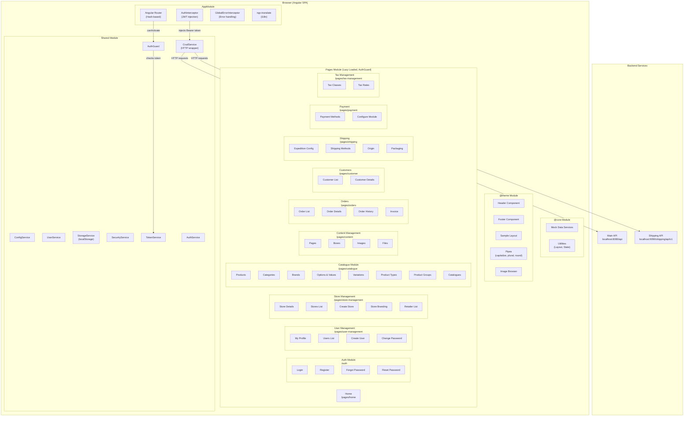
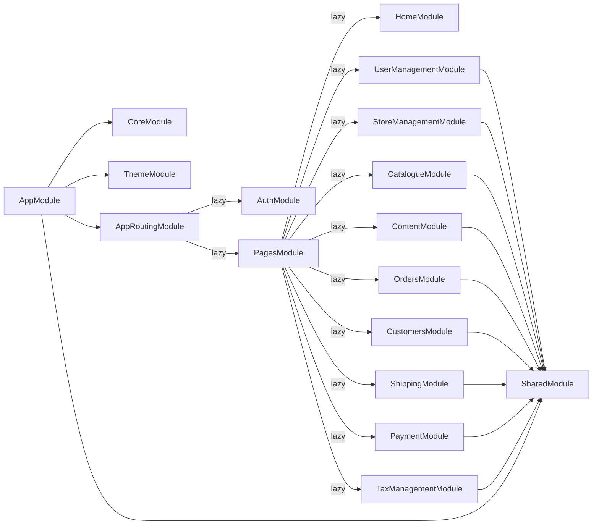
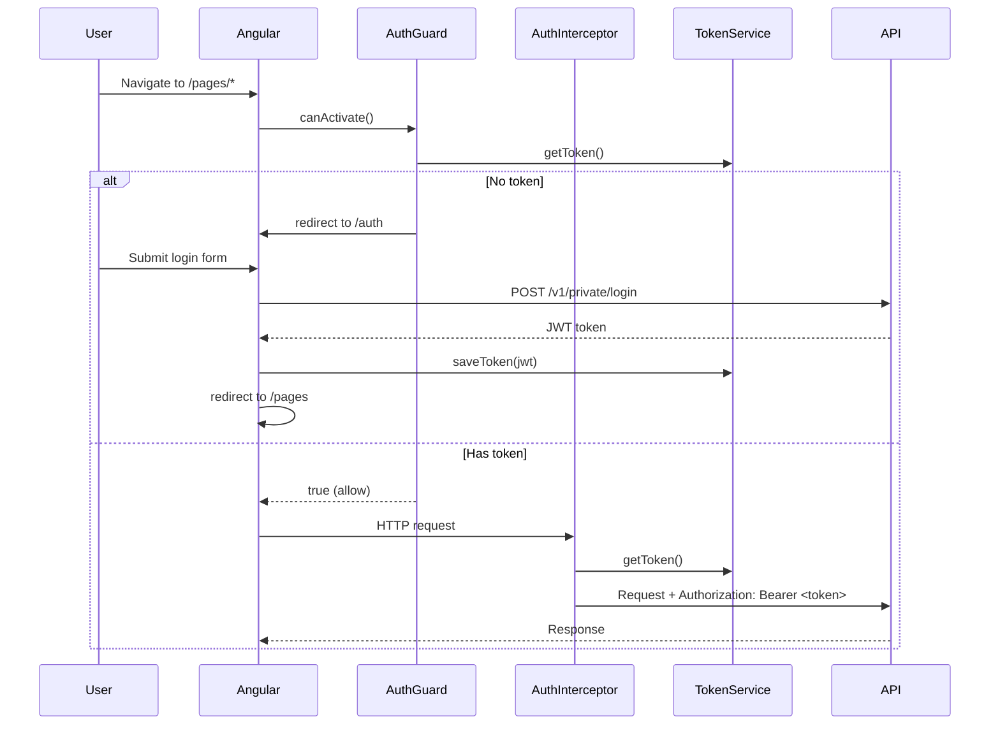
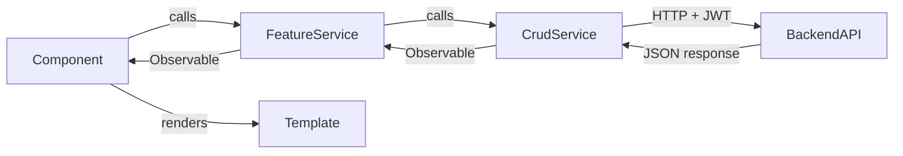
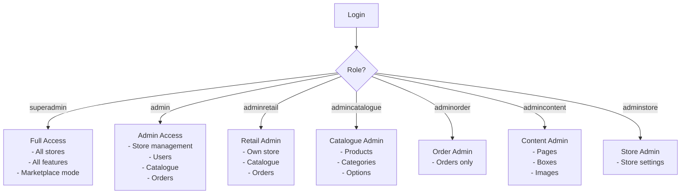
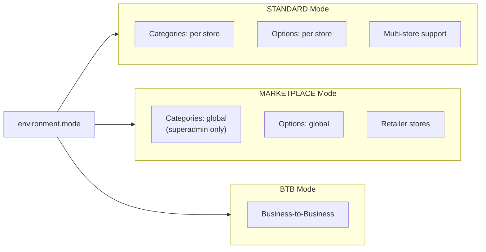

# Shopizer Admin - Architecture Diagram

## High-Level Architecture

---

## Module Dependency Graph

---

## Authentication Flow

---

## Data Flow

---

## Role-Based Access Control

---

## Store Modes

